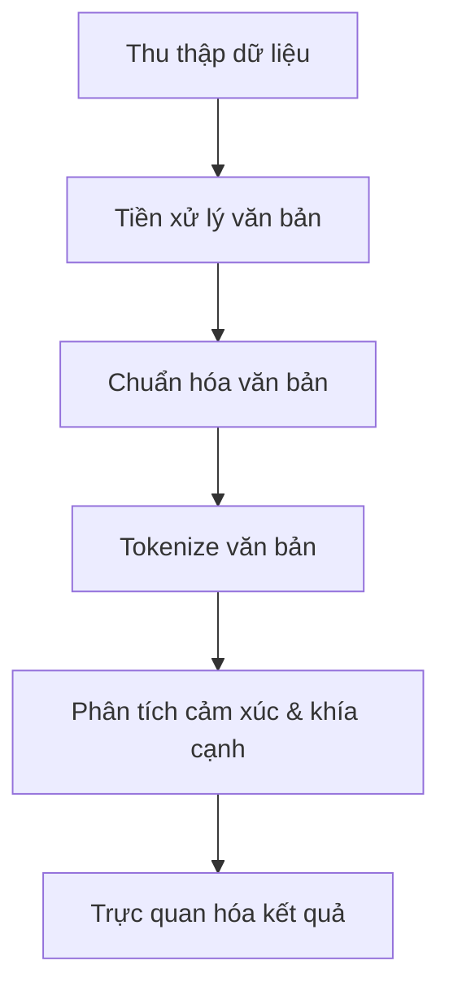

# Dự án Phân tích Cảm xúc Đánh giá Sản phẩm Tiki

<div align="center">
  
  <h3>Hệ thống phân tích cảm xúc đánh giá sản phẩm dựa trên mô hình PhoBERT</h3>
  <p><em>Dự án môn học DS221 - Khoa học dữ liệu</em></p>
</div>

## 📋 Tổng quan

Dự án này xây dựng hệ thống phân tích cảm xúc và phân loại khía cạnh từ đánh giá sản phẩm trên trang thương mại điện tử Tiki.vn. Hệ thống tự động thu thập dữ liệu đánh giá, tiền xử lý văn bản tiếng Việt, áp dụng mô hình học sâu để phân tích cảm xúc và khía cạnh, cuối cùng trực quan hóa kết quả trên giao diện web thân thiện với người dùng.

### 🌟 Tính năng chính

- **Thu thập dữ liệu tự động**: Crawl thông tin và đánh giá sản phẩm từ Tiki.vn
- **Tiền xử lý văn bản tiếng Việt**: Làm sạch, chuẩn hóa và tokenize văn bản
- **Phân tích cảm xúc**: Phân loại đánh giá thành 5 mức độ (rất tiêu cực → rất tích cực)
- **Phân loại khía cạnh**: Xác định khía cạnh được đề cập (chất lượng, giá cả, vận chuyển, CSKH)
- **Đề xuất mua/không mua**: Dựa trên phân tích tổng hợp từ các đánh giá
- **Giao diện web trực quan**: Hiển thị kết quả phân tích dưới dạng biểu đồ và thông tin tổng hợp

## 🔍 Kiến trúc hệ thống

Dự án được tổ chức theo mô hình Medallion Architecture với 3 lớp dữ liệu:

1. **Bronze**: Dữ liệu thô được thu thập từ Tiki.vn
2. **Silver**: Dữ liệu sau khi tiền xử lý và làm sạch
3. **Gold**: Dữ liệu đã gán nhãn cảm xúc và khía cạnh, sẵn sàng cho phân tích

### Quy trình xử lý



## 💻 Công nghệ sử dụng

- **Backend**: Python, Flask
- **Frontend**: HTML, CSS, JavaScript, Bootstrap 5
- **Xử lý dữ liệu**: Pandas, NumPy
- **Trực quan hóa**: Chart.js
- **Thu thập dữ liệu**: Selenium, BeautifulSoup4, Requests
- **NLP & Deep Learning**: PyTorch, PhoBERT
- **Container**: Docker (tùy chọn)

## 📁 Cấu trúc dự án

```
.
├── app/                      # Ứng dụng web Flask
│   ├── static/               # CSS, JS và tài nguyên tĩnh
│   ├── templates/            # HTML templates
│   └── app.py                # Mã nguồn chính ứng dụng Flask
├── browser_profiles/         # Thư mục chứa profiles trình duyệt
├── data/                     # Thư mục chứa dữ liệu
│   ├── Bronze/               # Dữ liệu thô
│   ├── Silver/               # Dữ liệu đã tiền xử lý
│   └── Gold/                 # Dữ liệu đã gán nhãn và sẵn sàng sử dụng
├── logs/                     # Thư mục chứa logs
├── models/                   # Thư mục chứa mô hình đã huấn luyện
├── src/                      # Mã nguồn
│   ├── __init__.py       
│   ├── pipeline.py           # File điều phối toàn bộ pipeline
│   ├── data_collection/      # Thu thập dữ liệu
│   │   ├── __init__.py
│   │   ├── crawl_category_urls.py
│   │   ├── crawl_product_urls.py
│   │   └── crawl_product_reviews.py
│   ├── data_preprocessing/   # Tiền xử lý dữ liệu
│   │   ├── __init__.py
│   │   ├── clean_data.py
│   │   ├── normalize_text.py
│   │   └── tokenize_text.py
│   ├── data_embedding/       # Embedding và mô hình phân tích
│   │   ├── __init__.py
│   │   └── sentiment_aspect_extraction.py
│   └── utils/                # Tiện ích và hàm hỗ trợ
│       ├── __init__.py
│       ├── constants.py
│       └── driver_setup.py
├── README.md
├── requirements.txt
└── Dockerfile                # Tùy chọn: Để chạy ứng dụng trong Docker
```

## 🚀 Cài đặt

### Yêu cầu hệ thống

- Python 3.8+ 
- Chrome Browser
- 4GB RAM trở lên (khuyến nghị 8GB cho huấn luyện mô hình)
- Kết nối internet ổn định
- Khuyến nghị: GPU để huấn luyện mô hình (tùy chọn)

### Bước 1: Clone dự án

```bash
git clone <repository-url>
cd <repository-dir>
```

### Bước 2: Cài đặt môi trường

#### Sử dụng virtualenv (khuyến nghị)

```bash
# Tạo môi trường ảo
python -m venv venv

# Kích hoạt môi trường ảo
# Windows
venv\Scripts\activate
# Linux/Mac
source venv/bin/activate

# Cài đặt các thư viện cần thiết
pip install -r requirements.txt
```

#### Sử dụng Conda

```bash
conda create -n tiki-sentiment python=3.8
conda activate tiki-sentiment
pip install -r requirements.txt
```

### Bước 3: Cài đặt ChromeDriver

Đảm bảo bạn đã cài đặt Chrome và ChromeDriver phù hợp với phiên bản Chrome của bạn. Dự án sử dụng `webdriver_manager` để tự động tải ChromeDriver phù hợp.

### Bước 4: Tải mô hình

Mô hình đã được huấn luyện sẵn có thể tải từ Google Drive:

```bash
# Tạo thư mục chứa mô hình
mkdir -p models/phobert_finetuned

# Tải mô hình đã huấn luyện từ Google Drive
# Link tải: https://drive.google.com/drive/folders/1xPzW1QtjgUnX8JZbz6HTZoc_3rDoGOCr?usp=sharing
# Sau khi tải xuống, đặt file best_model.pt vào thư mục models/phobert_finetuned/
```

> **Lưu ý**: File mô hình có kích thước lớn (~522MB) nên không được lưu trữ trên GitHub. Vui lòng tải từ Google Drive theo đường dẫn ở trên.

## 🎮 Sử dụng

### Chạy ứng dụng web

```bash
# Từ thư mục gốc của dự án
cd app
python app.py
```

Truy cập ứng dụng tại: http://localhost:5000

### Chạy toàn bộ pipeline xử lý dữ liệu

```bash
# Từ thư mục gốc của dự án
python src/pipeline.py
```

### Chạy một hoặc nhiều bước cụ thể

```bash
python src/pipeline.py --steps crawl_category crawl_products
```

Các bước khả dụng:
- `crawl_category`: Thu thập URL danh mục sản phẩm
- `crawl_products`: Thu thập URL sản phẩm
- `crawl_reviews`: Thu thập đánh giá sản phẩm
- `clean_data`: Làm sạch dữ liệu
- `normalize_text`: Chuẩn hóa văn bản
- `tokenize_text`: Tokenize văn bản
- `train_model`: Huấn luyện mô hình (nếu chưa có)
- `label_aspects`: Gán nhãn khía cạnh cho đánh giá

## 📊 Kết quả phân tích

Hệ thống cung cấp các thông tin phân tích sau:

1. **Phân tích cảm xúc**:
   - Tỷ lệ phần trăm của 5 mức độ cảm xúc (rất tích cực → rất tiêu cực)
   - Biểu đồ phân bố cảm xúc

2. **Phân tích khía cạnh**:
   - Điểm số cho 4 khía cạnh: Chất lượng, Giá cả, Vận chuyển, CSKH
   - Biểu đồ radar thể hiện điểm số các khía cạnh

3. **Khuyến nghị mua sắm**:
   - Đề xuất có nên mua sản phẩm hay không dựa trên phân tích tổng hợp
   - Hiển thị đánh giá tiêu biểu để minh họa

## 🤝 Đóng góp

Nếu bạn muốn đóng góp cho dự án, vui lòng:

1. Fork repository
2. Tạo nhánh chức năng (`git checkout -b feature/amazing-feature`)
3. Commit thay đổi (`git commit -m 'Add some amazing feature'`)
4. Push lên nhánh (`git push origin feature/amazing-feature`)
5. Mở Pull Request

## 📝 Tài liệu tham khảo

- [PyTorch Documentation](https://pytorch.org/docs/stable/index.html)
- [PhoBERT: Pre-trained language models for Vietnamese](https://github.com/VinAIResearch/PhoBERT)
- [Flask Documentation](https://flask.palletsprojects.com/)
- [Selenium with Python](https://selenium-python.readthedocs.io/)
- [Beautiful Soup Documentation](https://www.crummy.com/software/BeautifulSoup/bs4/doc/)

## 👥 Nhóm phát triển

Dự án được phát triển bởi nhóm sinh viên môn DS221 - Xử lý ngôn ngữ tự nhiên


Dự án này được phát hành theo giấy phép MIT. Xem file `LICENSE` để biết thêm chi tiết.

---

<div align="center">
  <p>© 2025 Dự án Phân tích Cảm xúc Đánh giá Sản phẩm Tiki</p>
</div> 